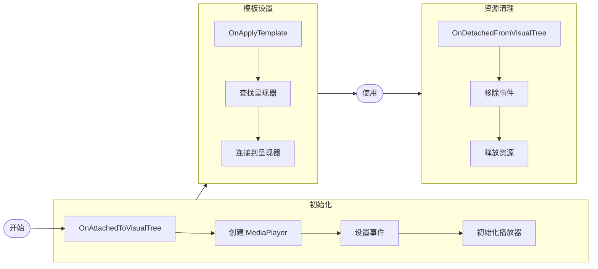
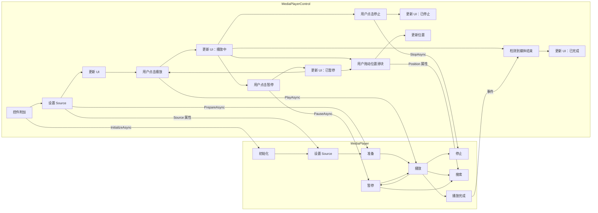

`MediaPlayerControl` 是一个功能齐全的媒体播放 UI 控件，提供传输控件、进度显示、音量控制和视频渲染。它封装了一个 `MediaPlayer` 实例，并为媒体播放提供了丰富的用户界面。

:::info
此控件作为 [Avalonia Pro](https://avaloniaui.net/pricing) 或更高版本的一部分提供。
:::

## 入门指南

1. 通过运行 `dotnet add package` 安装 `Avalonia.Controls.MediaPlayer` NuGet 包。

```bash
dotnet add package Avalonia.Controls.MediaPlayer
```

2. 在可执行项目文件（`.csproj`）中包含您的 Avalonia 许可证密钥。您可以从 [Avalonia 门户](https://portal.avaloniaui.net) 获取您的许可证密钥。

```xml
<ItemGroup>
  <AvaloniaUILicenseKey Include="您的许可证密钥" />
</ItemGroup>
```

:::tip
对于多项目解决方案，您可以将许可证密钥存储在[环境变量](https://learn.microsoft.com/en-us/visualstudio/msbuild/how-to-use-environment-variables-in-a-build)或[共享属性文件](https://learn.microsoft.com/en-us/visualstudio/msbuild/customize-by-directory?view=vs-2022#directorybuildprops-example)中，以避免重复。
:::

3. 在您的 `App.axaml` 文件的 `Application.Styles` 中引用默认的 `MediaFluentTheme`。这将添加媒体播放器控件所需的资源。

```xml
<Application.Styles>
    <!-- 添加此声明以使用默认主题。 -->
    <MediaFluentTheme/>
</Application.Styles>
```

有关安装 Avalonia Pro 控件的更多信息，请参阅[安装 Avalonia Pro](/tools/installing-avalonia-pro)。

## 使用示例

### 基本用法

默认的 `MediaPlayerControl` 带有功能齐全的 UI。有关更高级的用法和更深入的定制，您还可以[在没有 `MediaPlayerControl` 的情况下使用 `MediaPlayer` 类](/controls/media/mediaplayer/mediaplayer-class#using-mediaplayer-without-mediaplayercontrol)。

```xml
<MediaPlayerControl Name="mediaPlayerControl"
                    Source="{Binding MediaSource}"
                    Volume="0.8"
                    LoadedBehavior="AutoPlay" />
```

### 在代码后置中设置 Source

当通过代码后置而不是通过绑定设置 `Source` 时，必须等到控件加载完成。在构造函数中设置源将静默失败，因为底层播放器后端尚未初始化。

```csharp
// 不要在构造函数中设置 Source：
// public MainWindow()
// {
//     InitializeComponent();
//     mediaPlayerControl.Source = new UriSource("file:///C:/video.mp4"); // 太早了！
// }

// 相反，使用 OnLoaded：
protected override void OnLoaded(RoutedEventArgs e)
{
    base.OnLoaded(e);
    mediaPlayerControl.Source = new UriSource("file:///C:/Videos/sample.mp4");
}
```

请参阅[初始化时机](/controls/media/mediaplayer/media-playback#initialization-timing)了解详情。

### 绑定到命令

```xml
<Button Command="{Binding #mediaPlayerControl.PlayPauseCommand}"
        Content="播放/暂停"/>

<Button Command="{Binding #mediaPlayerControl.StopCommand}"
        Content="停止" />
```

### 错误处理

```csharp
mediaPlayerControl.ErrorOccurred += (sender, args) =>
{
    Console.WriteLine($"媒体错误：{args.Message}");
    args.Handled = true; // 阻止抛出异常。
};
```

**注意**：此回调让您有机会优雅地重置 `MediaPlayerControl` 的状态。

## 属性

### 基本属性

| 属性 | 类型 | 描述 |
|----------------|------------------|---------------------------------------------------------------------------------------------|
| Player | MediaPlayer | 获取处理实际媒体播放操作的底层 MediaPlayer 实例。 |
| Source | MediaSource | 获取或设置要播放的媒体源（`UriSource` 或 `StreamSource`）。 |
| LoadedBehavior | MediaPlayerState | 获取或设置媒体加载时的行为（`AutoPlay` 或 `Manual`）。 |

### 播放属性

| 属性 | 类型 | 描述 |
|------------------------------|-----------|------------------------------------------------------------------------------|
| Position | TimeSpan | 获取或设置当前播放位置。 |
| Duration | TimeSpan? | 获取当前媒体的总时长。对于不可搜索的媒体为 null。 |
| SkipTime | TimeSpan | 获取或设置前进/后退命令跳转的时间（默认：10 秒）。 |

### 状态属性

| 属性 | 类型 | 描述 |
|-------------------------|---------|--------------------------------------------------------------------|
| IsBuffering | bool | 获取媒体当前是否正在缓冲。 |
| BufferProgress | double? | 获取缓冲进度（0.0-1.0）。如果不可用则为 null。 |
| IsPaused | bool | 获取媒体播放当前是否暂停。 |
| IsMediaActive | bool | 获取媒体当前是否活跃（已加载和/或正在播放）。 |
| HasVideo | bool | 获取当前媒体是否包含视频内容。 |
| IsSeekable | bool | 获取当前媒体是否可以搜索。 |
| IsOverlayTimeoutEnabled | bool | 获取或设置控件覆盖层是否应在无活动后隐藏。 |

### 音频属性

| 属性 | 类型 | 描述 |
|----------|--------|--------------------------------------------------------------------------|
| Volume | double | 获取或设置播放音量，使用归一化值（例如 0.0-1.0）。 |
| IsMuted | bool | 获取音频当前是否静音。 |

### 命令属性

| 属性 | 类型 | 描述 |
|---------------------|----------|-----------------------------------------------------------------------|
| PlayPauseCommand | ICommand | 获取在播放和暂停状态之间切换的命令。 |
| StopCommand | ICommand | 获取停止播放的命令。 |
| MuteCommand | ICommand | 获取切换音频静音的命令。 |
| SkipForwardCommand | ICommand | 获取按 [SkipTime](#playback-properties) 量向前跳转的命令。 |
| SkipBackwardCommand | ICommand | 获取按 [SkipTime](#playback-properties) 量向后跳转的命令。 |

## 事件

| 事件 | 描述 |
|-----------------|--------------------------------------------------------------|
| ErrorOccurred | 当媒体操作过程中遇到错误时发生。 |

## 模板部件和自定义

`MediaPlayerControl` 的默认控件模板包括几个关键部件：

- **PART_MediaPlayerPresenter**：显示视频内容
- **MediaControlOverlay**：包含播放控件
- **MediaHoverOverlay**：包含悬停状态的 UI 元素

`MediaPlayerControl` 的最基本配置可以如下：

```xml
<!-- 在应用程序引用的 ResourceDictionary 中。 -->
<ControlTheme x:Key="{x:Type MediaPlayerControl}" TargetType="MediaPlayerControl">
  <Setter Property="Template">
    <ControlTemplate>
      <!-- 此边框用于装饰和在没有媒体时为控件设置默认背景。 -->
      <Border Background="Gray" ClipToBounds="True" CornerRadius="4">
        <Panel>
          <!-- 当有视频要显示时，此边框用于为 MediaPlayerPresenter 提供深色背景。 -->
          <Border IsVisible="{TemplateBinding HasVideo}">
            <Border Background="Black" IsVisible="{TemplateBinding IsMediaActive}"/>
          </Border>

          <!-- 此 ViewBox 控制 MediaPlayerPresenter 如何拉伸以适应控件的边界区域。 -->
          <Viewbox>
            <!-- 内部 MediaPlayer 在其中绘制视频的控件 -->
            <MediaPlayerPresenter Name="PART_MediaPlayerPresenter"/>
          </Viewbox>

          <!-- 覆盖层播放控件的示例。
                 使用内置 Commands 轻松控制播放。 -->
          <DockPanel LastChildFill="True" MaxHeight="64" VerticalAlignment="Bottom">
            <ProgressBar DockPanel.Dock="Bottom"
                         IsIndeterminate="True"
                         IsVisible="{TemplateBinding IsBuffering}"/>
            <StackPanel Orientation="Horizontal"
                        HorizontalAlignment="Center"
                        Spacing="10"
                        Margin="5"
                        TextElement.FontSize="24">
              <Button Content="&#x23EF;"
                      Padding="5,-5,5,0"
                      Command="{TemplateBinding PlayPauseCommand}"/>
              <Button Content="&#x23F9;"
                      Padding="5,-5,5,0"
                      Command="{TemplateBinding StopCommand}"/>
            </StackPanel>
          </DockPanel>
        </Panel>
      </Border>
    </ControlTemplate>
  </Setter>
</ControlTheme>
```

您可以将此样式和默认主题作为 `MediaPlayerControl` 所需外观的起点。

## 生命周期管理

`MediaPlayerControl` 自动管理其内部 `MediaPlayer` 的生命周期：



以下是 `MediaPlayerControl` 在其生命周期内与内部 `MediaPlayer` 交互的更全面图表：



## 最佳实践

1. **错误处理**：
   - 始终订阅 `ErrorOccurred` 事件以优雅地处理错误。
   - 如果您已处理了错误，在 `ErrorOccurred` 事件处理器上将 `Handled` 属性设置为 true。

2. **资源管理**：
   - 控件会自动管理 `MediaPlayerControl` 的生命周期。

3. **UI 集成**：
   - 使用内置命令与自定义按钮/控件集成。
   - `IsMediaActive` 属性对于启用/禁用 UI 元素很有用。

## 另请参阅

- [MediaPlayer 类](/controls/media/mediaplayer/mediaplayer-class)
- [MediaSource 类](/controls/media/mediaplayer/mediasource)
- [实现 MediaPlayer](/controls/media/mediaplayer/media-playback)
- [安装 Avalonia Pro](/tools/installing-avalonia-pro)
- [故障排除](/troubleshooting/controls/mediaplayer)
