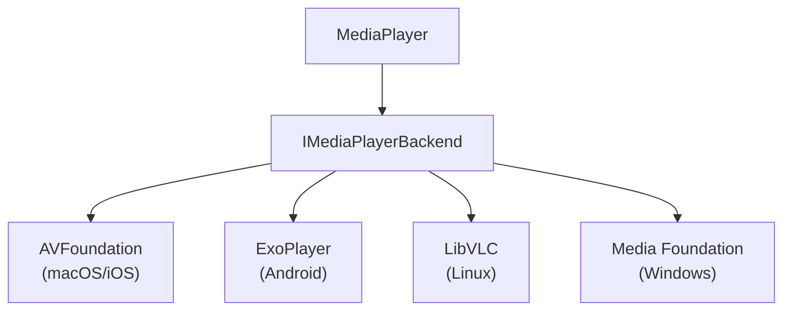

`MediaPlayer` 类为 Avalonia 应用程序中的媒体播放提供了核心功能。它处理媒体加载、播放控制和特定平台的后端管理，作为 [`MediaPlayerControl`](/controls/media/mediaplayer/mediaplayer-class) 背后的引擎。

:::info
此控件作为 [Avalonia Pro](https://avaloniaui.net/pricing) 或更高版本的一部分提供。
:::

## 在没有 MediaPlayerControl 的情况下使用 MediaPlayer

当在没有 `MediaPlayerControl` 的情况下使用 `MediaPlayer` 时，您必须先调用 `InitializeAsync()`，并确保仅在控件加载后设置源：

```csharp
private MediaPlayer _player = new MediaPlayer();

protected override async void OnLoaded(RoutedEventArgs e)
{
    base.OnLoaded(e);

    await _player.InitializeAsync();

    _player.Volume = 0.8;
    _player.LoadedBehavior = MediaPlayerState.AutoPlay;

    _player.Source = new UriSource("file:///C:/Videos/sample.mp4");
    await _player.PrepareAsync();
    await _player.PlayAsync();
}
```

## 属性

### 媒体源属性

| 属性 | 类型 | 描述 |
|----------|-------------|-----------------------------------------------------------------------------|
| Source | MediaSource | 获取或设置要播放的媒体源（`UriSource` 或 `StreamSource`）。 |

### 播放属性

| 属性 | 类型 | 描述 |
|----------------|---------------------------|--------------------------------------------------------------------|
| Position | TimeSpan | 获取或设置当前播放位置。 |
| Duration | TimeSpan? | 获取媒体的总时长。对于不可搜索的媒体为 null。 |
| LoadedBehavior | MediaPlayerLoadedBehavior | 获取或设置媒体加载时的播放行为。 |

### 状态属性

| 属性 | 类型 | 描述 |
|------------------|---------|--------------------------------------------------------|
| IsSeekable | bool | 获取当前媒体是否支持搜索。 |
| IsBuffering | bool | 获取媒体当前是否正在缓冲。 |
| BufferProgress | double? | 获取缓冲进度（0.0-1.0）。如果不可用则为 null。 |
| HasVideo | bool | 获取当前媒体是否包含视频内容。 |
| LastErrorMessage | string | 获取错误状态中的最新错误消息。 |

### 音频属性

| 属性 | 类型 | 描述 |
|----------|--------|---------------------------------------------|
| Volume | double | 获取或设置播放音量（0.0-1.0）。 |
| IsMuted | bool | 获取或设置音频是否静音。 |

### 高级属性

| 属性 | 类型 | 描述 |
|-----------------|-----------------|----------------------------------------------------|
| Statistics | MediaStatistics | 获取播放统计信息（如果可用）。 |
| ForceVlcBackend | bool（静态） | 强制使用 VLC 后端（仅限调试）。 |

## 事件

| 事件 | 描述 |
|------------------------|-------------------------------------------------------|
| NaturalSizeChanged | 当视频的自然大小发生变化时发生。 |
| MediaPrepared | 当媒体已准备就绪时发生。 |
| MediaStarted | 当媒体播放已开始时发生。 |
| MediaPaused | 当媒体播放已暂停时发生。 |
| MediaStopped | 当媒体播放已停止时发生。 |
| MediaPlaybackCompleted | 当媒体播放已完成时发生。 |
| ErrorOccurred | 当遇到错误时发生。 |
| PropertyChanged | 标准的 INotifyPropertyChanged 事件。 |

## 方法

| 方法 | 返回类型 | 描述 |
|-------------------|-------------|-----------------------------------------------|
| InitializeAsync() | Task | 初始化媒体播放器及其后端。 |
| PrepareAsync() | Task | 准备媒体进行播放。 |
| PlayAsync() | Task | 开始或恢复媒体播放。 |
| PauseAsync() | Task | 暂停媒体播放。 |
| StopAsync() | Task | 停止媒体播放。 |
| ReleaseAsync() | Task | 释放当前媒体的资源。 |
| UnInitialize() | Task | 释放播放器使用的所有资源。 |

## 后端架构

`MediaPlayer` 使用可插拔的后端架构来支持不同平台：

后端选择基于平台自动进行：



## 使用示例

### 基本播放

:::caution
在 Avalonia UI 完全加载之前，`MediaPlayer` 尚未准备好接受媒体源。始终在 `Loaded` 事件触发后设置 `Source` 属性。请参阅[初始化时机](/controls/media/mediaplayer/media-playback#initialization-timing)了解详情。
:::

```csharp
private MediaPlayer _player = new MediaPlayer();

protected override async void OnLoaded(RoutedEventArgs e)
{
    base.OnLoaded(e);

    await _player.InitializeAsync();

    _player.Volume = 0.8;
    _player.LoadedBehavior = MediaPlayerLoadedBehavior.Manual;

    _player.Source = new UriSource("file:///C:/Videos/sample.mp4");
    await _player.PrepareAsync();
    await _player.PlayAsync();
}
```

### 使用自定义视觉

您可以附加一个自定义视觉目标：

```xml
<Window xmlns="https://github.com/avaloniaui"
        Width="800" Height="450">

    <Grid RowDefinitions="*, Auto">
        <Viewbox VerticalAlignment="Stretch" HorizontalAlignment="Stretch">
            <MediaPlayerPresenter Name="presenter" />
        </Viewbox>
    </Grid>

</Window>
```

```csharp
private MediaPlayer _player = new MediaPlayer();

protected async override void OnLoaded(EventArgs e)
{
    base.OnLoaded(e);

    await _player.InitializeAsync();

    _player.UpdateTargetVisual(presenter);
    _player.NaturalSizeChanged += Player_NaturalSizeChanged;
}

private void Player_NaturalSizeChanged(object? sender, NaturalSizeChangedEventArgs e)
{
    UpdatePlayerSize(e.NewSize ?? default);
}

private void UpdatePlayerSize(Size size)
{
    var elemVisual = ElementComposition.GetElementChildVisual(presenter);
    var compositor = elemVisual?.Compositor;

    if (compositor is null || elemVisual is null)
    {
        return;
    }

    elemVisual.Size = new Vector(size.Width, size.Height);
    (presenter as MediaPlayerPresenter)?.SetNaturalSize(size);
    presenter.InvalidateMeasure();
}
```
`MediaPlayerPresenter` 为方便起见而提供，但您可以使用任何自定义视觉。确保使用 `MediaPlayer` 实例提供的大小更新视觉。

### 事件处理

```csharp
// 设置事件处理器
player.MediaPrepared += (s, e) => Console.WriteLine("准备播放");
player.MediaStarted += (s, e) => Console.WriteLine("播放已开始");
player.MediaPlaybackCompleted += (s, e) => Console.WriteLine("播放已完成");

// 错误处理
player.ErrorOccurred += (s, e) => {
    Console.WriteLine($"错误：{e.ErrorMessage}");
};
```

### 资源清理

```csharp
// 完成后清理
await player.StopAsync();
await player.ReleaseAsync();
await player.UnInitialize();
```

## 错误处理

MediaPlayer 使用基于事件的方法进行错误处理：

- 当发生错误时，播放器在内部转换为错误状态
- `ErrorOccurred` 事件会附带详细的错误信息触发
- 大多数方法会检查错误状态并且不会继续执行
- 调用 ReleaseAsync() 以重置错误状态

```csharp
// 订阅错误事件
player.ErrorOccurred += (sender, args) =>
{
    // 在此处使用您的自定义逻辑适当处理错误。
    // 如果需要在其他地方重新播放，请使用 ReleaseAsync() 重置。
    // ...
    Console.WriteLine($"错误：{args.Message}");
};

// 尝试播放媒体
try {
    await player.PlayAsync();
}
catch (Exception ex) {
    // 如果需要，进行备用异常处理
    if (player.LastErrorMessage != null) {
        Console.WriteLine($"错误：{player.LastErrorMessage}");

        // 可选地重置播放器
        await player.ReleaseAsync();
    }
}
```

## 最佳实践

1. **初始化时机**：
   - 永远不要在构造函数中设置 `Source`。播放器在 UI 加载之前未就绪。
   - 在 `OnLoaded` 重写中设置 `Source`，或使用 `Dispatcher.UIThread.Post` 延迟调用。
   - 有关完整指导，请参阅[初始化时机](/controls/media/mediaplayer/media-playback#initialization-timing)。

2. **初始化和清理**：
   - 在使用 `MediaPlayer` 之前始终调用 `InitializeAsync()`。
   - 在加载不同媒体源之间调用 `ReleaseAsync()`。
   - 当完全完成使用 `MediaPlayer` 时调用 `UnInitialize()`。

3. **错误处理**：
   - 订阅 `ErrorOccurred` 事件以处理播放错误。

4. **资源管理**：
   - 正确清理以避免资源泄漏。
   - 考虑为多个要顺序播放的媒体项复用单个 `MediaPlayer` 实例。

5. **平台考虑**：
   - 在所有目标平台上测试媒体播放。

## 另请参阅

- [MediaPlayer 控件](/controls/media/mediaplayer)
- [MediaSource 类](/controls/media/mediaplayer/mediasource)
- [实现 MediaPlayer](/controls/media/mediaplayer/media-playback)
- [安装 Avalonia Pro](/tools/installing-avalonia-pro)
- [故障排除](/troubleshooting/controls/mediaplayer)
